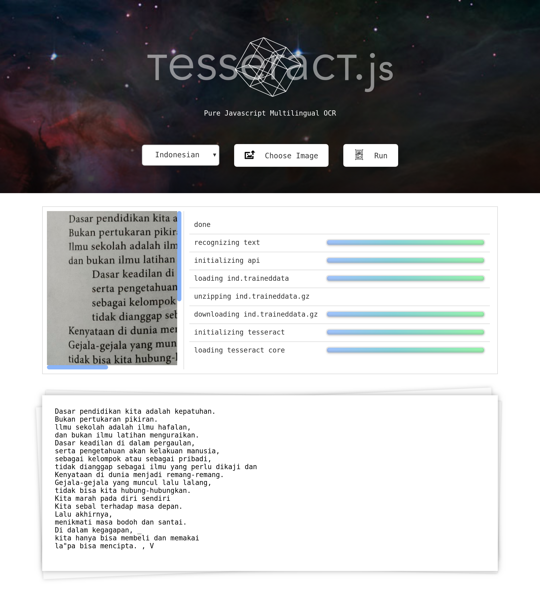

 
## Prakata

Isu kecurangan PEMILU 2019 seolah mendapati pijakan kakinya dibumi, menyelinap dalam benak, lalu merasuki sanubari melalui siratan bukti-bukti yang tak dapat begitu saja di tampik oleh semua pihak yang terlibat, ataupun mereka-mereka yang memiliki kepentingan dalam pelaksanaan PEMILU kali ini.

Terdapat satu pertanyaan yang di ajukan oleh hakim ketua dalam sidang sengketa kecurangan pemilu 2019 yang kemudian mendasari adanya repository ini. Adapun maksudnya adalah untuk memberi gambaran bahwa "human error" atau kesalahan-kesalahan teknis akibat kelalaian yang di timbulkan oleh manusia sesungguhnya dapat diminimalisir bahkan dapat dicegah jika terdapat sebuah komitment etik dari para pengampuh kekuasaan dalam setiap pangambilan kebijakan.

Rakyat mungkin dapat dikelabui / dikaburkan nalar dengan sengkarut anrgumentasi retoris nan apologetik, namun segala bentuk pretensi politis tersebut tentu tak dapat dengan serta-merta membatah jika 1 + 1 = 2. Logika dasar itulah yang kasat mencuat kepermukaan kala data hasil PEMILU yang dimuat dalam situng KPU (Komisi Pemilihan Umum) tak serima dalam nada-nada ekuivalen sebagaimana maktubah legal formil C1-nya.

## Pengertian
[Optical Character Recognition / OCR ](https://id.wikipedia.org/wiki/Pengenalan_karakter_optis) *(Pengenalan Karakter Optik)*  adalah sebuah perangkat lunak yang mengubah teks dalam format berkas citra atau gambar ke dalam format teks yang bisa dibaca dan disunting oleh aplikasi komputer. Berkas teks berformat citra tersebut didapatkan dengan cara memindai atau memfoto sebuah buku, manuskrip, tulisan di papan pengumuman, ataupun materi kuliah di papan tulis dsb. Sedangkan alat yang diunakan untuk memindai adalah pemindai *(scanner)* atau kamera baik kamera DSLR ataupun kamera di ponsel pintar.

Sebagai perangkat lunak yang kompleks, OCR diterapkan di berbagai bidang seperti untuk membaca data secara otomatis dan langsung memasukkannya ke dalam basis data -- contohnya seperti dalam pemindaian passport, nota transfer bank, kertas berharga – untuk pengenalan pelat kendaraan bermotor dari video atau gambar yang tertangkap kamera, dan yang paling marak adalah untuk preservasi konten buku-buku sumber referensi utama dan manuskrip bersejarah. Dalam beberapa kasus, OCR berkontribusi sangat besar dalam proses pembangunan perpustakaan digital.

    
## Penggunaan
1. Unduh Repository ini.
2. Buka menggunakan "teks editor".
3. jalankan dengan "live-server".

    ➡️ [Demo](https://dvd-azr.github.io/optical-character-recognition-clientSideProcessing/)
    
## Library
 - [Tesseract.js](https://github.com/naptha/tesseract.js)